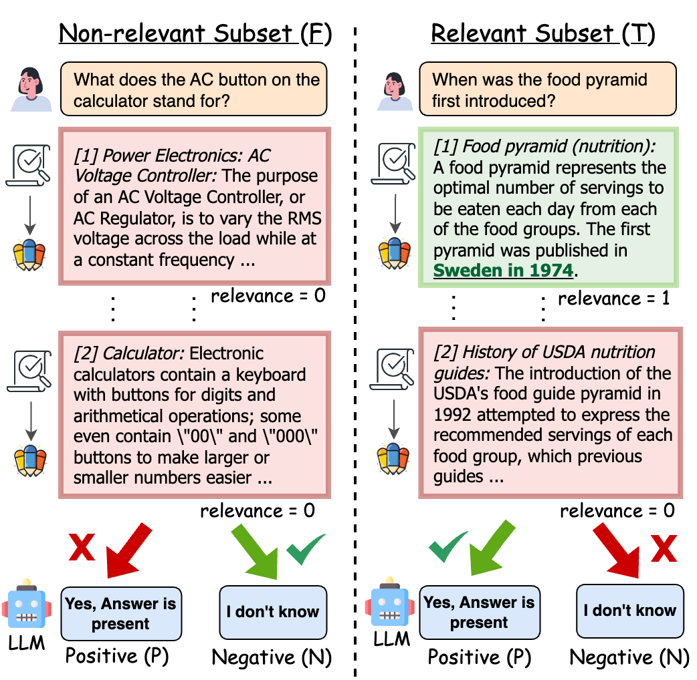
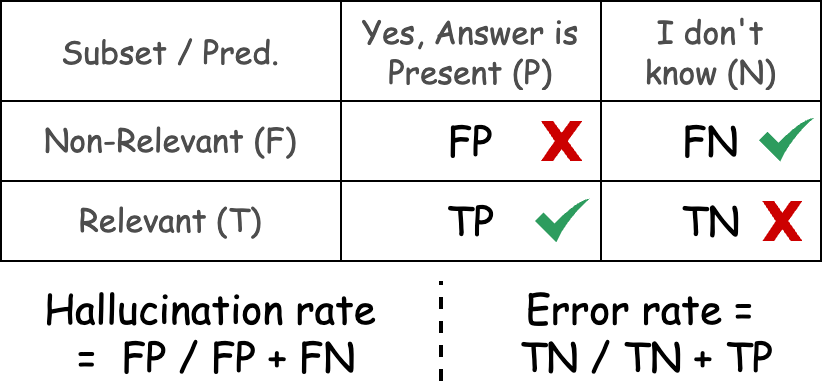

# NoMIRACL: Knowing When You Don’t Know for Robust Multilingual Retrieval-Augmented Generation

<p align="center">
    <a href="https://github.com/project-miracl/nomiracl">
        
    </a>
    <a href="https://www.python.org/">
            
    </a>
    <a href="https://github.com/project-miracl/nomiracl/blob/main/LICENSE">
        
    </a>
    <a href="https://arxiv.org/abs/2312.11361">
        
    </a>
</p>

<h4 align="center">
    <a href="https://arxiv.org/abs/2312.11361"></a>
</h4>

## Introduction

Retrieval Augmented Generation (RAG) is a powerful approach to incorporate external knowledge into large language models (LLMs) to enhance the accuracy and faithfulness of generated responses. However, evaluating LLM robustness in RAG across different language families has been a challenge, leading to gaps in understanding the model's performance against errors in external retrieved knowledge. To address this, we present NoMIRACL, a human-annotated dataset designed for evaluating LLM robustness in RAG across 18 typologically diverse languages.

NoMIRACL includes both a non-relevant and a relevant subset. The non-relevant subset contains queries with passages manually judged as non-relevant or noisy, while the relevant subset includes queries with at least one judged relevant passage. LLM robustness is measured using two key metrics: hallucination rate and error rate.

## GPT-4 Hallucination Results on NoMIRACL

| Code | Subset          | Set  | \#Q   | Accuracy | Hallucination | Invalid | Subset | \#Q   | Accuracy | Error | Invalid |
|------|-----------------|------|-------|----------|---------------|--------|---------|-------|----------|-------|---------|
| ar   | Non-relevant    | Test | 250   | 61.6%   | 36.0%          | 2.4%   | Relevant| 250   | 88.4%   | 11.2%     | 0.4%   |
| bn   | Non-relevant    | Test | 250   | 60.0%   | 40.0%          | 0.0%   | Relevant| 250   | 82.8%   | 17.2%     | 0.0%   |
| de   | Non-relevant    | Test | 217   | 63.6%   | 35.9%          | 0.5%   | Relevant| 250   | 88.4%   | 10.4%     | 1.2%   |
| en   | Non-relevant    | Test | 250   | 57.2%   | 42.4%          | 0.4%   | Relevant| 250   | 94.8%   | 4.8%      | 0.4%   |
| es   | Non-relevant    | Test | 250   | 87.2%   | 11.6%          | 1.2%   | Relevant| 250   | 77.6%   | 22.0%     | 0.4%   |
| fa   | Non-relevant    | Test | 250   | 57.2%   | 42.8%          | 0.0%   | Relevant| 250   | 86.4%   | 13.6%     | 0.0%   |
| fr   | Non-relevant    | Test | 250   | 52.4%   | 46.8%          | 0.8%   | Relevant| 250   | 88.4%   | 11.2%     | 0.4%   |
| fi   | Non-relevant    | Test | 124   | 60.5%   | 38.7%          | 0.8%   | Relevant| 250   | 84.0%   | 15.2%     | 0.8%   |
| hi   | Non-relevant    | Test | 250   | 78.8%   | 21.2%          | 0.0%   | Relevant| 250   | 78.8%   | 21.2%     | 0.0%   |
| id   | Non-relevant    | Test | 250   | 63.2%   | 36.8%          | 0.0%   | Relevant| 250   | 66.0%   | 33.6%     | 0.4%   |
| ja   | Non-relevant    | Test | 250   | 56.8%   | 42.8%          | 0.4%   | Relevant| 250   | 95.6%   | 4.4%      | 0.0%   |
| ko   | Non-relevant    | Test | 250   | 59.6%   | 40.4%          | 0.0%   | Relevant| 250   | 87.2%   | 12.8%     | 0.0%   |
| ru   | Non-relevant    | Test | 250   | 58.0%   | 42.0%          | 0.0%   | Relevant| 250   | 93.6%   | 6.4%      | 0.0%   |
| sw   | Non-relevant    | Test | 250   | 91.2%   | 8.8%           | 0.0%   | Relevant| 250   | 78.8%   | 20.4%     | 0.8%   |
| te   | Non-relevant    | Test | 250   | 74.8%   | 25.2%          | 0.0%   | Relevant| 250   | 58.0%   | 42.0%     | 0.0%   |
| th   | Non-relevant    | Test | 250   | 46.8%   | 53.2%          | 0.0%   | Relevant| 250   | 95.6%   | 4.4%      | 0.0%   |
| yo   | Non-relevant    | Test | 250   | 75.2%   | 24.4%          | 0.4%   | Relevant| 204   | 85.8%   | 13.7%     | 0.5%   |
| zh   | Non-relevant    | Test | 250   | 56.4%   | 43.6%          | 0.0%   | Relevant| 250   | 95.6%   | 4.4%      | 0.0%   |
| Avg. | Non-relevant    | Test |  -    | 64.5%   | 35.2%          | 0.4%   | Relevant|   -   | 84.8%   | 14.9%	    |  0.3%  | 


## NoMIRACL Dataset and GPT-4 Baseline

The NoMIRACL dataset is available in HuggingFace under: `miracl/nomiracl`.

HuggingFace Page: [https://huggingface.co/datasets/miracl/nomiracl](https://huggingface.co/datasets/miracl/nomiracl) 

```python
import datasets

language = 'german'  # or any of the 18 languages
subset = 'relevant'  # or 'non_relevant'
split = 'test'       # or 'dev' for development split

# four combinations available: 'dev.relevant', 'dev.non_relevant', 'test.relevant' and 'test.non_relevant'
nomiracl = datasets.load_dataset('miracl/nomiracl', language, split=f'{split}.{subset}')
```

GPT-4 Baseline results (250 queries) are available within the repository under `./results/GPT-4`.

An example datapoint under `./results/GPT-4/non-relevant/en.test.non_relevant.vanilla_prompt.jsonl`
```
{
"query_id": "842558#0", 
"docids": ["2842207#5", "7004944#45", "3310762#14", "47220460#1", "36451733#7", "3310762#20", "4724576#4", "22373402#0", "52203230#0", "23126218#4"], 
"prompt": "I will give you a question and several contexts containing information about the question. [ ... ] \n\nOUTPUT:\n", 
"template": "vanilla", 
"results": {"gpt-4-azure": "Yes, answer is present."} # or "I don't know."
}
```

## Getting Started (TBA)

> We are currently in the process of releasing our code to replicate our experiments. Please stay tuned!

## Background and Problem Identification

Retrieval Augmented Generation (RAG) is essential for leveraging external knowledge in generating accurate responses. Large language models (LLMs) like GPT-3 and LLAMA-2 are widely used for RAG, but challenges exist in ensuring robust and reliable output.

The first-stage information retrieval system poses challenges in accurately retrieving relevant information, leading to errors in generated responses. No comprehensive evaluation of LLM reasoning capabilities in multiple languages has been conducted, leaving a gap in understanding robustness across different language resources.

## NoMIRACL Dataset Construction


NoMIRACL is a multilingual dataset designed to evaluate LLM robustness against errors in first-stage retrieval. The dataset covers 18 typologically diverse languages and includes two subsets: non-relevant and relevant.

### Non-Relevant Subset (F)
- Queries with no-known answers.
- All top-k passages manually judged as non-relevant (relevancy score = 0).

### Relevant Subset (T)
- Queries with known answers.
- At least one of the top-k passages manually judged as relevant (relevancy score = 1).

## Evaluation Metrics (TBA)



We conduct a robustness evaluation using a binary classification task, comparing LLM predictions against the ground truth provided in NoMIRACL. The metrics used are hallucination rate and error rate.

- **Hallucination Rate:** Measures the model's tendency to hallucinate an answer when no answer is present in the non-relevant subset.

- **Error Rate:** Measures the model's inaccuracy in recognizing relevant passages in the relevant subset.

## NoMIRACL Dataset Overview

### Languages Covered:
Arabic (ar), Bengali (bn), German (de), English (en), Spanish (es), Persian (fa), Finnish (fi), French (fr), Hindi (hi), Indonesian (id), Japanese (ja), Korean (ko), Russian (ru), Swahili (sw), Thai (th), Yoruba (yo), Chinese (zh).

### Dataset Usage:
NoMIRACL is dynamic and customizable. Users can provide a sampling ratio for queries in the non-relevant to relevant subset, enabling flexibility in dataset utilization.

## Experimental Setup

### Baseline Model: GPT-4

We use GPT-4 as the baseline model for our experiments. GPT-4 is a closed-book LLM known for its multilingual capabilities.

#### Model Settings:
- Context window size: 4096 tokens
- Temperature score: 0.3
- Top-p sampling ratio: 0.95
- Maximum output length: 50 tokens

#### Vanilla Prompting:
We employ a zero-shot monolingual listwise prompting strategy using a vanilla prompt template. The template includes the input query and all top-k (oracle) passages, providing a short description of the task in English.

#### Cost Reduction:
To limit experimental costs, we truncate each passage to 390 tokens, and the evaluation is limited to a maximum of 250 randomly sampled queries for all languages in both NoMIRACL relevant and non-relevant splits.

---

**Note:** This README provides an overview of the NoMIRACL project. For detailed information, instructions, and updates, refer to the official [project-miracl/nomiracl](https://github.com/project-miracl/nomiracl) repository.