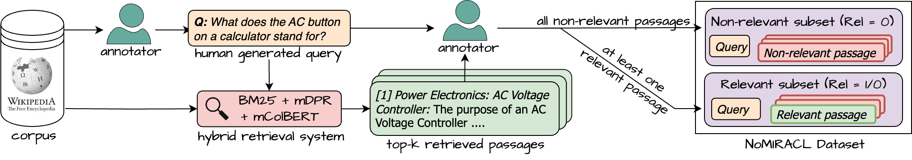
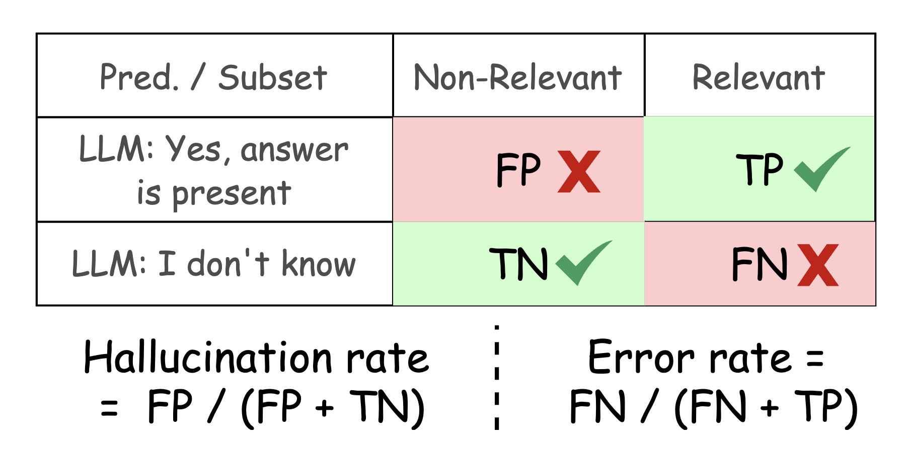

# NoMIRACL: A Multilingual Relevance Assessment Dataset for RAG Applications
<p align="center">
    <a href="https://aclanthology.org/2024.findings-emnlp.730/">
        
    </a>
    <a href="https://github.com/project-miracl/nomiracl">
        
    </a>
    <a href="https://www.python.org/">
            
    </a>
    <a href="https://github.com/project-miracl/nomiracl/blob/main/LICENSE">
        
    </a>
</p>

<h4 align="center">
    <a href="./"></a>
    <footer><br clear="all"/>The image has been generated using miramuseai.net and Adobe photoshop.</footer>
</h4>

NoMIRACL [[EMNLP'24 Findings]](https://aclanthology.org/2024.findings-emnlp.730/) is a multilingual relevance assessment dataset for evaluating query \& passage relevancy in large language models (LLMs). This is extremely useful in RAG settings, i.e., when a retrieval systems retrieves a subset of passages or documents which either can or cannot be relevant to the user query. The LLM (as the generator) should assess the relevancy and only answer -- *if* a relevant passage is found within the subset, else abstain from answering.

**This repository provides starter code to evaluate diverse multilingual LLMs using our prompt template on NoMIRACL.**

For more information, checkout out our publication:
- [“Knowing When You Don’t Know”: A Multilingual Relevance Assessment Dataset for Robust Retrieval-Augmented Generation](https://aclanthology.org/2024.findings-emnlp.730/) (Thakur et al., :star: EMNLP 2024 Findings)


## :wrench: Installation
You can install NoMIRACL code repository via pip:

```python
pip install nomiracl
```

If you want to build from source, use:

```bash
$ git clone https://github.com/project-miracl/nomiracl.git
$ cd nomiracl
$ pip install -e .
```

## :star: Getting Started

#### 1. Loading NoMIRACL Dataset 
- 50\% of relevant examples, 50\% of non-relevant, both maximum capped at 250. 
- Full example available in [sample_load_no_miracl.py](./examples/sample_load_no_miracl.py).
```python
from nomiracl.dataset import NoMIRACLDataLoader

data_loader = NoMIRACLDataLoader(language = "english", 
                                 split = "test", # or 'dev' 
                                 hf_dataset_name="miracl/nomiracl", 
                                 load_from_huggingface=True)
                        
corpus, queries, qrels = data_loader.load_data_sample(
    relevant_ratio = 0.5, non_relevant_ratio = 0.5, max_sample_pool = 250)
```

#### 2. LLM prompt generation
- Full example available in [sample_model_generation.py](./examples/sample_model_generation.py).
```python
from nomiracl.generation.utils import load_model

model_name = "meta-llama/Meta-Llama-3-8B-Instruct"

# List of techniques supported in nomiracl: 
# huggingface (GPUs), vllm (GPUs), cohere (API), openai (API), nvidia (API), azure (API), anyscale (API)
# `cohere` requires COHERE_API_KEY, `openai` requires OPENAI_API_KEY, `nvidia` requires NVIDIA_API_KEY
# `azure` requires AZURE_OPENAI_API_BASE, AZURE_OPENAI_API_VERSION and AZURE_OPENAI_API_KEY
# `anyscale` requires ANYSCALE_BASE_URL and ANYSCALE_API_KEY.

technique = "vllm" # or huggingface or nvidia, anyscale etc.

model = load_model(
    technique, # technique
    model_name, # model_name
    cache_dir="<your-cache-dir>", # extra kwargs
    batch_size=2, # extra kwargs
    num_gpus=1, # extra kwargs
    concurrency=2 # extra kwargs
)

# Sample prompts
prompts = [
    "What is the capital of France?",
    "What is the capital of Germany?",
    "What is the capital of Italy?",
]

model_results = model.call(prompts)

for prompt, result in zip(prompts, model_results):
    print("Prompt: {}".format(prompt))
    print("{} result: {}".format(model_name, result))
```

#### 3. Loading our paper used prompt templates
- Full example available in [sample_vanilla_prompt_exploration.py](./examples/sample_vanilla_prompt_exploration.py).

```python
from nomiracl.prompts.utils import load_prompt_template

# Options include: vanilla, role, repeat, explanation 
prompt_cls = load_prompt_template("vanilla", count = 10) # as we include 10 passages

query = "Which is the best programming language?"

passages = [
    "Python is the best programming language.",
    "Javascript is the best programming language.",
    "Go is the best programming language.",
    "Java is the best programming language.",
    "C# is the best programming language.",
    "Ruby is the best programming language.",
    "R is the best programming language.",
    "C++ is the best programming language.",
    "C is the best programming language.",
    "Rust is the best programming language.",
]

prompt = prompt_cls(query=query, passages=passages)
```

Or you can provide your **own** custom prompt template by modifying the `self.template` in `nomiracl.VanillaTemplate`.

```python
from nomiracl.prompts import VanillaTemplate

class CustomTemplate(VanillaTemplate):
    def __init__(self, count: int = 1):
        super().__init__(count)
        self.template = (
            "This is a pairwise prompt template. Respond as either "{self.answer}" or "{self.no_answer}".'
            + "\n\nQUESTION:\n{query}\n\n"
            + "CONTEXT:\n"
            + "\n\n".join(
                [
                    "[{}] {}".format(i, "{" + passage + "}")
                    for i, passage in enumerate(self.passage_variables, 1)
                ]
            )
            + "\n\nOUTPUT:\n"
        )
```

## :hugs: NoMIRACL Dataset

The NoMIRACL dataset is available in HuggingFace under: `miracl/nomiracl`.

Languages covered: Arabic (ar), Bengali (bn), German (de), English (en), Spanish (es), Persian (fa), Finnish (fi), French (fr), Hindi (hi), Indonesian (id), Japanese (ja), Korean (ko), Russian (ru), Swahili (sw), Thai (th), Yoruba (yo), Chinese (zh).

HuggingFace Page: [https://huggingface.co/datasets/miracl/nomiracl](https://huggingface.co/datasets/miracl/nomiracl) 

```python
import datasets

language = 'german'  # or any of the 18 languages
subset = 'relevant'  # or 'non_relevant'
split = 'test'       # or 'dev' for development split

# four combinations available: 'dev.relevant', 'dev.non_relevant', 'test.relevant' and 'test.non_relevant'
nomiracl = datasets.load_dataset('miracl/nomiracl', language, split=f'{split}.{subset}')
```

### Model identifiers for evaluation in NoMIRACL

| Acronym | Model Name | Model Link |
| :-----: | :--------: | :--------: |
| GPT-4 | `gpt-4-azure`| [AzureAI](https://learn.microsoft.com/en-us/azure/ai-services/openai/) |
| GPT-3.5 | `gpt-3.5-azure`| [AzureAI](https://learn.microsoft.com/en-us/azure/ai-services/openai/) |
| Mixtral-7x8B | `Mixtral-8x7B-Instruct-v0.1`| :hugs: [model](https://huggingface.co/mistralai/Mixtral-8x7B-Instruct-v0.1) |
| Mistral-7B | `Mistral-7B-Instruct-v0.2`| :hugs: [model](https://huggingface.co/mistralai/Mistral-7B-Instruct-v0.2) |
| Orca-2-13B | `Orca-2-13b`| :hugs: [model](https://huggingface.co/microsoft/Orca-2-13b) |
| Orca-2-7B | `Orca-2-7b`| :hugs: [model](https://huggingface.co/microsoft/Orca-2-7b) |
| Aya-101 | `aya-101`| :hugs: [model](https://huggingface.co/CohereForAI/aya-101) |
| LLAMA-2-70B | `llama-2-70b-chat`| :hugs: [model](https://huggingface.co/meta-llama/Llama-2-70b-chat-hf) |
| LLAMA-2-13B |`llama-2-13b-chat`| :hugs: [model](https://huggingface.co/meta-llama/Llama-2-13b-chat-hf) |
| LLAMA-2-7B | `llama-2-7b-chat`| :hugs: [model](https://huggingface.co/meta-llama/Llama-2-7b-chat-hf) |
| Flan-T5-XXL |`flan-t5-xxl`| :hugs: [model](https://huggingface.co/google/flan-t5-xxl) |

### Baseline Accuracy on NoMIRACL non-relevant subset (test split, maximum cap of 250 per language)

Baseline results (250 queries) are available within the repository under `./results/baselines/non_relevant`.

An example datapoint under `./results/baselines/non_relevant/en.test.vanilla_prompt.jsonl`
```
{
    "query_id": "842558#0", 
    "docids": ["2842207#5", "7004944#45", "3310762#14", "47220460#1", "36451733#7", "3310762#20", "4724576#4", "22373402#0", "52203230#0", "23126218#4"], 
    "prompt": "I will give you a question and several contexts containing information about the question. [ ... ] \n\nOUTPUT:\n", 
    "template": "vanilla", 
    "results": {"gpt-4-azure": "Yes, answer is present.", 
                "llama-2-13b-chat": "\nYes, answer is present in [6].\n\nNo answers found in the other contexts.",
                [...]
                "aya-101": "Wales"}
}
```

| Code | Set  | \#Q  | GPT-4 | GPT-3.5 | Mistral-7B | Mixtral-7x8B | LLAMA-2-70B | LLAMA-2-13B | LLAMA-2-7B | flan-t5-xxl | Orca-2-7B | Orca-2-13B | aya-101 |
|------|----- |------|-------|----------|---------------|--------|---------|-------|----------|-------|---------|---------|---------|
| ar   | Test | 250   | 61.60% | 46.40% | 87.20% | 89.20% | 0.0% | 15.60% | 0.0% | 0.80% | 3.60% | 10.40% | 23.20% |
| bn   | Test | 250   | 60.00% | 4.80% | 83.20% | 90.00% | 0.0% | 2.40% | 0.4% | 0.00% | 5.60% | 3.20% | 10.00% |
| de   | Test | 217   | 63.59% | 53.00% | 87.56% | 68.20% | 0.5% | 5.07% | 0.9% | 3.23% | 5.07% | 12.90% | 29.03% |
| en   | Test | 250   | 57.20% | 54.80% | 90.00% | 72.40% | 0.0% | 0.80% | 2.8% | 16.40% | 12.00% | 6.80% | 15.60% |
| es   | Test | 250   | 87.20% | 64.80% | 92.00% | 90.80% | 0.8% | 0.40% | 11.2% | 10.80% | 14.40% | 10.40% | 3.20% |
| fa   | Test | 250   | 57.20% | 23.60% | 82.40% | 90.40% | 0.0% | 4.80% | 0.0% | 0.40% | 0.40% | 14.00% |  14.40% |
| fr   | Test | 250   | 52.40% | 44.00% | 82.40% | 58.40% | 0.0% | 0.00% | 0.4% | 2.40% | 6.00% | 9.20% | 22.00% |
| fi   | Test | 124   | 60.48% | 65.32% | 87.90% | 89.52% | 0.0% | 4.84% | 0.0% | 0.00% | 2.42% | 27.42% | 33.06% |
| hi   | Test | 250   | 78.80% | 29.60% | 91.60% | 95.60% | 0.0% | 3.20% | 0.8% | 0.00% | 0.40% | 9.20%  | 17.60% |
| id   | Test | 250   | 63.20% | 56.80% | 89.20% | 83.20% | 0.4% | 4.80% | 1.6% | 6.80% | 2.80% | 14.40% | 19.60% |
| ja   | Test | 250   | 56.80% | 32.40% | 89.20% | 82.80% | 0.0% | 4.00% | 0.0% | 0.80% | 7.60% | 24.00% | 10.40% |
| ko   | Test | 250   | 59.60% | 40.00% | 88.40% | 90.00% | 0.0% | 0.80% | 1.2% | 0.00% | 3.60% | 10.80% | 14.40% |
| ru   | Test | 250   | 58.00% | 34.80% | 90.00% | 78.40% | 0.8% | 4.00% | 0.4% | 1.60% | 11.20% | 9.20% | 31.60% |
| sw   | Test | 250   | 91.20% | 66.40% | 95.20% | 88.00% | 0.0% | 0.80% | 0.4% | 7.60% | 4.40% | 14.00% | 27.60% |
| te   | Test | 250   | 74.80% | 6.80% | 81.20% | 84.80% | 0.0% | 0.40% | 0.0% | 1.60% | 6.80% | 8.00% | 24.00% |
| th   | Test | 250   | 46.80% | 4.00% | 90.40% | 67.20% | 0.0% | 16.40% | 0.0% | 0.80% | 4.40% | 5.60% | 11.20% |
| yo   | Test | 250   | 75.20% | 74.80% | 95.20% | 89.20% | 0.0% | 1.20% | 0.4% | 12.80% | 13.60% | 14.80% | 20.00% |
| zh   | Test | 250   | 56.40% | 43.60% | 86.80% | 78.40% | 0.0% | 6.00% | 0.0% | 5.20% | 4.40% | 10.80% | 9.20% |
| Avg. | Test |  -    | **64.5%** | **41.44%** | **88.33%** | **82.6%** | **0.1%** | **4.2%** | **1.14%** | **3.96%** | **6.04%** | **11.95%** | **18.67%** | 


### Baseline Accuracy on NoMIRACL relevant subset (test split, maximum cap of 250 per language)

Baseline results (250 queries) are available within the repository under `./results/baselines/relevant`.

An example datapoint under `./results/baselines/relevant/en.test.vanilla_prompt.jsonl`
```
{
    "query_id": "8706103#0", 
    "docids": ["42057469#2", "4998067#1", "29247933#0", "162619#81", "422315#13", "26790310#4", "41298602#18", "22816#16", "123427#61", "23576525#0"], 
    "prompt": "I will give you a question and several contexts containing information about the question. [ ... ] \n\nQUESTION:\nWhat is the course that will be discontinued as defined by the National Education Policy? [ ... ] \n\nOUTPUT:\n", 
    "template": "vanilla", 
    "results": {"gpt-4-azure": "I don't know.", 
                "llama-2-13b-chat": "Please answer the question based on the given contexts.",
                [...]
                "aya-101": "I don't know"}
}
```


| Code | Set  | \#Q  | GPT-4 | GPT-3.5 | Mistral-7B-v0.2 | Mixtral-7x8B | LLAMA-2-70B | LLAMA-2-13B | LLAMA-2-7B | flan-t5-xxl | Orca-2-7B | Orca-2-13B | aya-101 |
|------|----- |------|-------|----------|---------------|--------|---------|-------|----------|-------|---------|---------|---------|
| ar   | Test | 250  | 88.40% | 91.20% | 32.80% | 59.20% | 96.40% | 62.40% | 62.0% | 100.0% | 82.80% | 51.60% | 16.40% |
| bn   | Test | 250  | 82.80% | 64.80% | 26.40% | 43.20% | 97.60% | 42.40% | 71.6% | 100.0% | 40.00% | 80.00% | 20.00% |
| de   | Test | 217  | 88.40% | 93.60% | 26.80% | 74.40% | 88.80% | 52.80% | 56.4% | 99.2% | 86.00% | 92.00% | 25.60% |
| en   | Test | 250  | 94.80% | 91.20% | 35.20% | 78.80% | 85.20% | 46.40% | 68.0% | 98.8% | 81.60% | 98.00% | 51.60% |
| es   | Test | 250  | 77.60% | 90.00% | 26.80% | 67.20% | 77.20% | 34.40% | 48.8% | 99.2% | 64.00% | 95.60% | 78.00% |
| fa   | Test | 250  | 86.40% | 95.60% | 30.80% | 46.80% | 99.20% | 85.60% | 72.0% | 100.0% | 84.40% | 61.60% | 24.40% |
| fr   | Test | 250  | 88.40% | 90.40% | 37.60% | 81.60% | 92.00% | 54.80% | 55.6% | 99.6% | 81.60% | 98.00% | 57.20% |
| fi   | Test | 124  | 84.00% | 87.60% | 24.80% | 65.20% | 98.40% | 6.00% | 93.2% | 100.0% | 79.20% | 75.20% | 23.60% |
| hi   | Test | 250  | 78.80% | 92.80% | 28.00% | 38.40% | 94.80% | 66.00% | 74.8% | 100.0% | 57.60% | 57.60% | 25.20% |
| id   | Test | 250  | 66.00% | 74.00% | 11.20% | 48.00% | 83.60% | 32.00% | 71.2% | 100.0% | 73.20% | 79.20% | 60.71% |
| ja   | Test | 250  | 95.60% | 97.20% | 31.20% | 69.20% | 98.40% | 52.40% | 69.2% | 100.0% | 62.80% | 64.80% | 45.60% |
| ko   | Test | 250  | 87.20% | 92.40% | 22.40% | 56.00% | 99.60% | 90.00% | 85.6% | 100.0% | 77.60% | 80.00% | 60.00% |
| ru   | Test | 250  | 93.60% | 94.40% | 32.40% | 77.20% | 83.20% | 61.60% | 96.4% | 100.0% | 79.60% | 85.20% | 22.80% |
| sw   | Test | 250  | 78.80% | 90.40% | 8.40% | 51.60% | 90.00% | 62.80% | 49.2% | 100.0% | 89.20% | 92.80% | 38.40% |
| te   | Test | 250  | 58.00% | 45.60% | 14.80% | 33.20% | 99.60% | 74.40% | 97.2% | 100.0% | 44.80% | 73.60% | 10.80% |
| th   | Test | 250  | 95.60% | 96.40% | 23.60% | 72.80% | 98.80% | 59.20% | 91.2% | 100.0% | 78.00% | 76.00% | 20.80% |
| yo   | Test | 250  | 85.78% | 64.22% | 8.33% | 34.31% | 91.18% | 62.25% | 62.3% | 99.5% | 79.41% | 82.84% | 18.14% |
| zh   | Test | 250  | 95.60% | 95.60% | 30.00% | 74.00% | 97.20% | 63.20% | 83.6% | 100.0% | 81.20% | 90.40% | 75.20% |
| Avg. | Test |  -   | **84.77%** | **85.97%** | **25.09%** | **59.51%** | **92.84%** | **56.04%** | **72.68%** | **99.8%** | **73.50%** | **79.69%** | **37.47%** |  


## NoMIRACL Dataset Construction



Retrieval Augmented Generation (RAG) is a powerful approach to incorporate external knowledge into large language models (LLMs) to enhance the accuracy and faithfulness of generated responses. However, evaluating LLM robustness in RAG across different language families has been a challenge, leading to gaps in understanding the model's performance against errors in external retrieved knowledge. To address this, we present NoMIRACL, a human-annotated dataset designed for evaluating LLM robustness in RAG across 18 typologically diverse languages.

NoMIRACL is a multilingual dataset designed to evaluate LLM robustness against errors in first-stage retrieval. The dataset covers 18 typologically diverse languages and includes two subsets: non-relevant and relevant.

### Non-Relevant Subset (F)
- Queries with no-known answers.
- All top-k passages manually judged as non-relevant (relevancy score = 0).

### Relevant Subset (T)
- Queries with known answers.
- At least one of the top-k passages manually judged as relevant (relevancy score = 1).

## Evaluation Metrics



We conduct a robustness evaluation using a binary classification task, comparing LLM predictions against the ground truth provided in NoMIRACL. The metrics used are hallucination rate and error rate.

- **Hallucination Rate:** `FP/(FP + TN)` Measures the model's tendency to hallucinate an answer when no answer is present in the non-relevant subset.

- **Error Rate:** `FN/(FN + TP)` Measures the model's inaccuracy in recognizing relevant passages in the relevant subset.

## :handshake: Collaboration and Acknowledgements

The NoMIRACL dataset has been made possible due to a collaborative effort of the following universities and organizations:

- University of Waterloo
- Huawei Noah's Ark Lab

Parts of the NoMIRACL code structure has been inspired by:
- [https://github.com/McGill-NLP/instruct-qa](https://github.com/McGill-NLP/instruct-qa)

## :scroll: Citations

If you use NoMIRACL or parts in a research paper, please cite our work as follows:

```
@article{thakur:2024,
  author       = {Nandan Thakur and
                  Luiz Bonifacio and
                  Xinyu Zhang and
                  Odunayo Ogundepo and
                  Ehsan Kamalloo and
                  David Alfonso{-}Hermelo and
                  Xiaoguang Li and
                  Qun Liu and
                  Boxing Chen and
                  Mehdi Rezagholizadeh and
                  Jimmy Lin},
  title        = {NoMIRACL: Knowing When You Don't Know for Robust Multilingual Retrieval-Augmented
                  Generation},
  journal      = {CoRR},
  volume       = {abs/2312.11361},
  year         = {2023},
  url          = {https://doi.org/10.48550/arXiv.2312.11361},
  doi          = {10.48550/ARXIV.2312.11361},
  eprinttype    = {arXiv},
  eprint       = {2312.11361},
  timestamp    = {Tue, 16 Jan 2024 11:57:42 +0100},
  biburl       = {https://dblp.org/rec/journals/corr/abs-2312-11361.bib},
  bibsource    = {dblp computer science bibliography, https://dblp.org}
}

```

---
Contact person: Nandan Thakur, [nandan.thakur@uwaterloo.co](mailto:nandan.thakur@uwaterloo.ca)

> This repository contains experimental software and is published for the sole purpose of giving additional background details on the respective publication.
